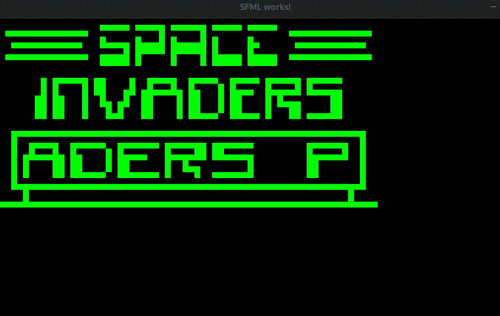

# Emuze
My hobby project to learn about emulators.

Emuze currently only supports Chip8 games.



# Run
You need a C++20 compiler (GCC g++ 10.1.0 recommended)

Install `SFML`, `spdlog`, `fmt` and `pthread` libraries on your system before compiling.

```bash
mkdir build && cd build
cmake ..
make
```

# License
Emuze is free software and is licensed under GPL-3.0 or newer, for more information see [LICENSE](LICENSE).
